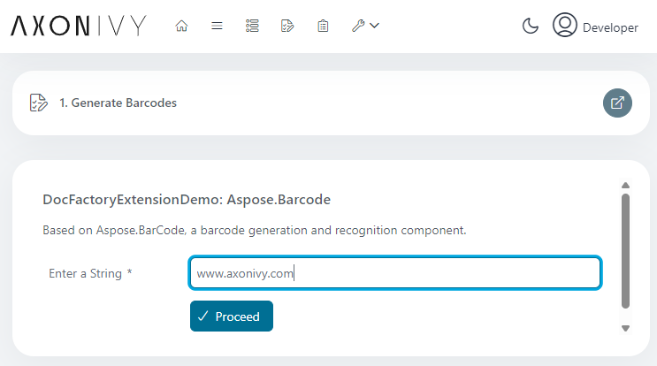
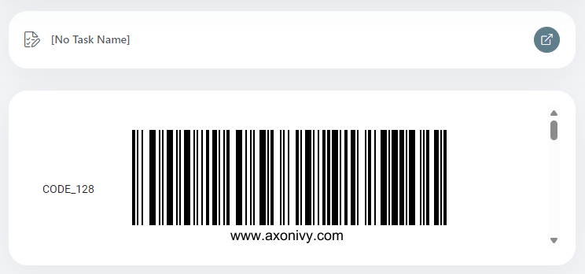

# Aspose.Barcode Demo
Aspose.Barcode is a powerful development library to generate & recognize barcodes. 
The aspose-barcode.jar is not part of the aspose components included the Axon Ivy DocFactory but can be added to the project classpath via maven extension as shown in this demo.

## Demo

With our demo for the connector we provide a simple UI for entering a string:

By pressing **Proceed** this string is converted to a barcode:

## Setup

Simply install the marketplace plug - nothing else needs to be done :blush:
