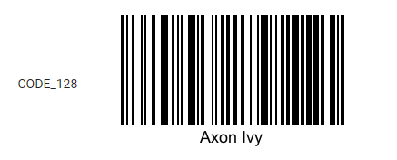

# Aspose.Barcode Demo
Aspose.Barcode is a powerful development library to generate & recognize barcodes. 
The aspose-barcode.jar is not part of the aspose components included the Axon Ivy DocFactory but can be added to the project classpath via maven extension as shown in this demo.

