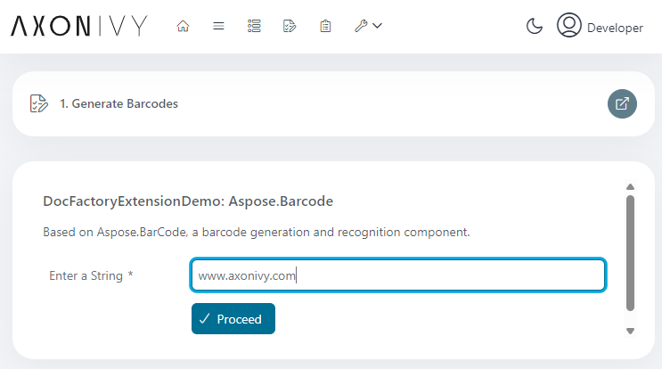

# Aspose.Barcode-Demo
Aspose.Barcode ist eine leistungsstarke Entwicklungsbibliothek zum Generieren
und Erkennen von Barcodes. Die Datei „aspose-barcode.jar” ist nicht Teil der
Aspose-Komponenten, die in Axon Ivy DocFactory enthalten sind, kann jedoch wie
in dieser Demo gezeigt über die Maven-Erweiterung zum Projekt-Klassenpfad
hinzugefügt werden.

## Demo

Mit unserer Demo für den Connector bieten wir eine einfache Benutzeroberfläche
zur Eingabe einer Zeichenfolge: 

Durch Drücken von „ **“ (Weiter) unter „** “ (Barcode-Datei erstellen) wird
diese Zeichenfolge in einen Barcode umgewandelt: 

## Einrichtung

Installieren Sie einfach den Marketplace Connector – mehr müssen Sie nicht tun
:blush:
