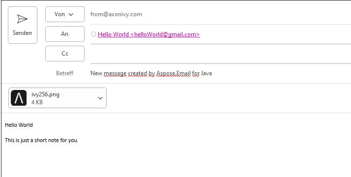

# Aspose.Email Demo
Aspose.Email is a powerful library to create, manipulate and convert email formats including MSG, EML, EMLX and MHT without any Microsoft Outlook dependencies.
The aspose-mail.jar is not part of the aspose components included the Axon Ivy DocFactory but can be added to the project classpath via maven extension as shown in this demo.

