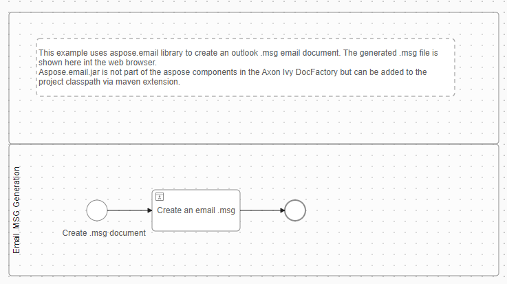
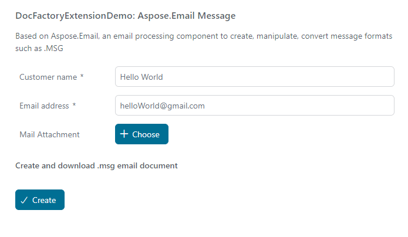

# Aspose.Email Demo

Aspose.Email is a powerful library to create, manipulate and convert email formats including MSG, EML, EMLX and MHT without any Microsoft Outlook dependencies.
The aspose-mail.jar is not part of the aspose components included the Axon Ivy DocFactory but can be added to the project classpath via maven extension as shown in this demo.

## Demo

When you start this demo, a UI opens:

Pushing the button "Create" will generate a `newEmail.msg` file, according to you input you have entered in the UI before.

The `newEmail.msg` file can be opened with Outlook

## Setup

Simply install the marketplace connector - nothing else needs to be done.
