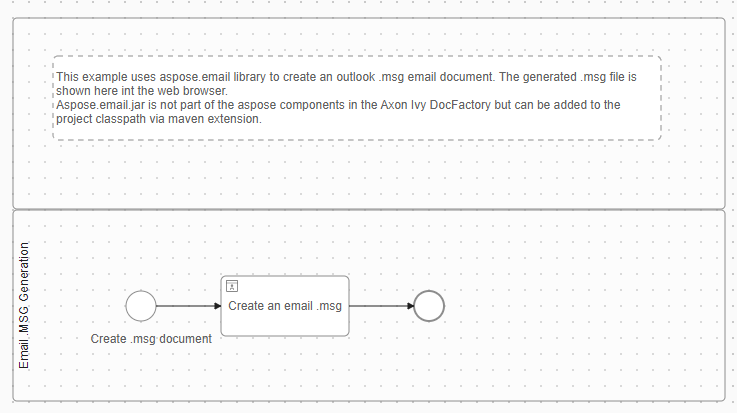
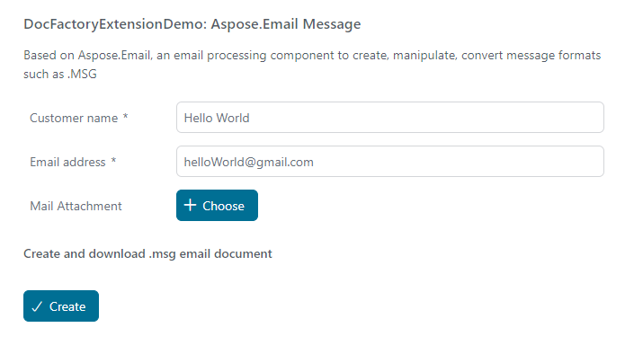
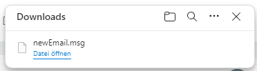
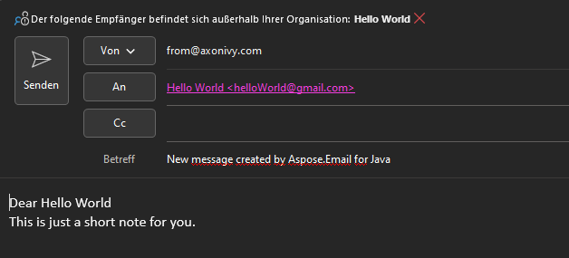

# Aspose.Email-Demo

Aspose.Email ist eine leistungsstarke Bibliothek zum Erstellen, Bearbeiten und
Konvertieren von E-Mail-Formaten wie MSG, EML, EMLX und MHT ohne Abhängigkeiten
von Microsoft Outlook. Die Datei „aspose-mail.jar” ist nicht Teil der
Aspose-Komponenten, die in Axon Ivy DocFactory enthalten sind, kann jedoch wie
in dieser Demo gezeigt über die Maven-Erweiterung zum Projekt-Klassenpfad
hinzugefügt werden.

## Demo

Wenn Sie diese Demo starten, öffnet sich eine Benutzeroberfläche:

Durch Klicken auf die Schaltfläche „Erstellen“ wird eine Datei „ `newEmail.msg“
im Format „` “ generiert, entsprechend den Angaben, die Sie zuvor in der
Benutzeroberfläche eingegeben haben.

Die Datei „ `newEmail.msg` ” kann mit Outlook geöffnet werden.

## Setup

Installieren Sie einfach den Marketplace Connector – mehr müssen Sie nicht tun
:blush:
