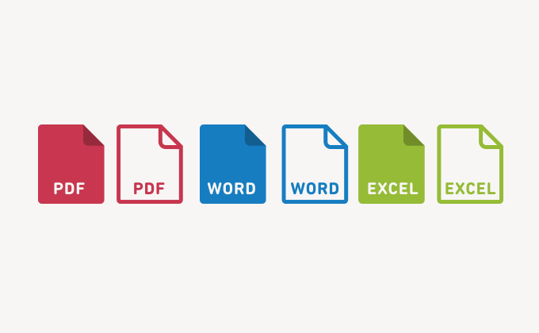

# Dokumentfabrik
Die Document Factory ist ein System, mit dem Dokumente wie Seriendruckbriefe
mithilfe von Microsoft Office-Vorlagen (.dot- oder .dotx-Dateien) automatisch
generiert werden können. Die Document Factory ist offen, kann erweitert werden
und basiert auf der Java-Bibliothek Aspose, die in der Axon Ivy-Plattform
enthalten ist.

## Einrichtung
Um Bilder in eine Seriendruckvorlage einzufügen, empfehlen wir die Verwendung
von [Aspose
DocumentBuilder](https://docs.aspose.com/words/java/insert-picture-in-document/),
das Bilder während des Seriendruckvorgangs programmgesteuert abruft und einfügt.
Dieser Ansatz bietet eine stabilere und wartungsfreundlichere Lösung als die
Verwendung des Seriendruckfelds „ `INCLUDEPICTURE` ”.

*Weitere Informationen finden Sie unter Prozess **3.1: Funktionen zur
Dokumentenerstellung** im Demo-Projekt.*
